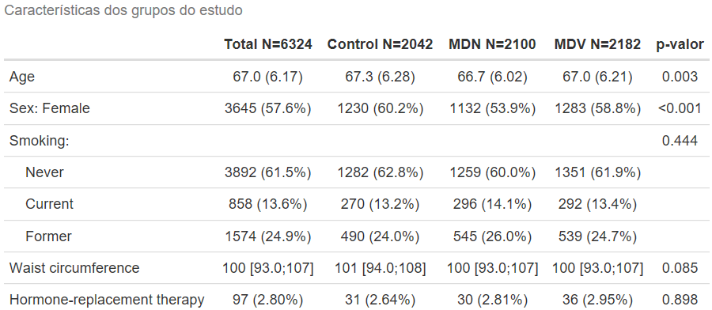
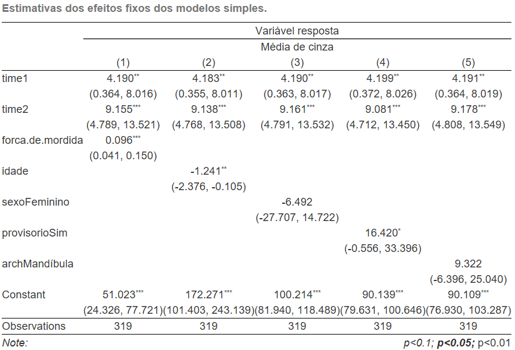
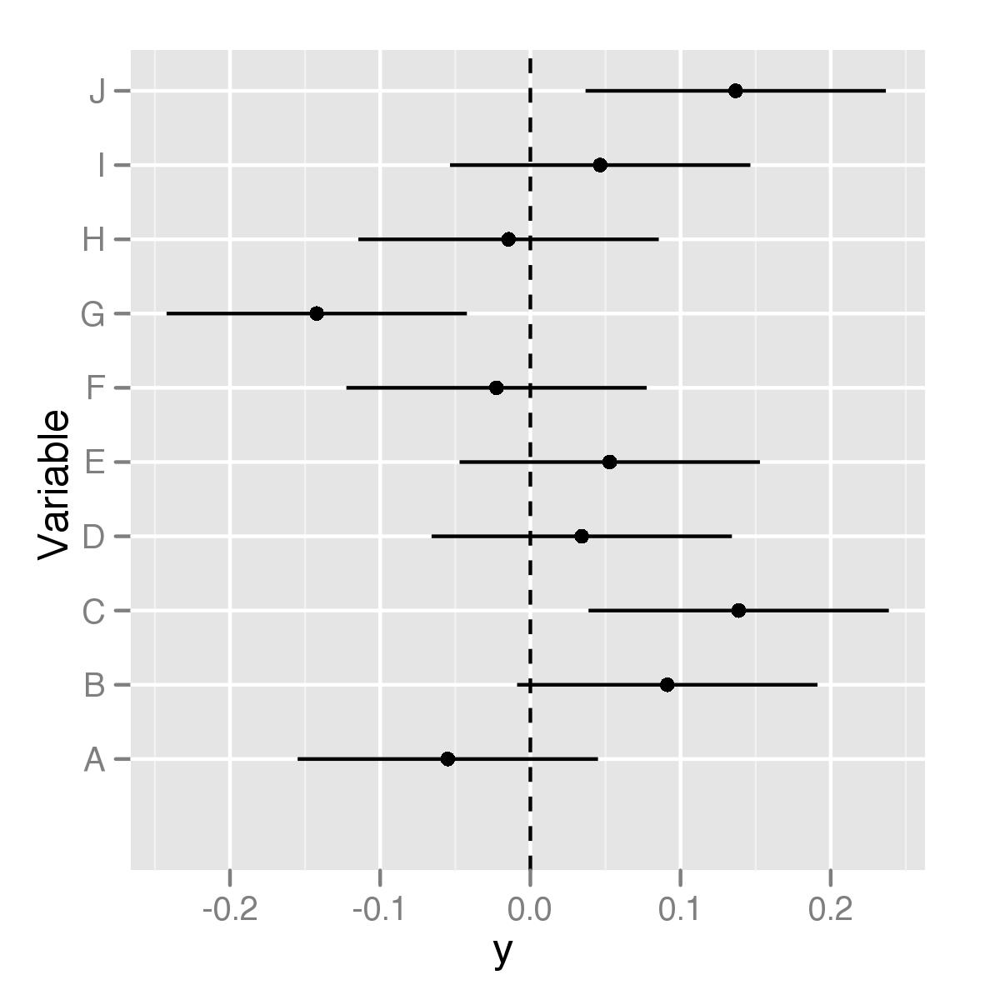
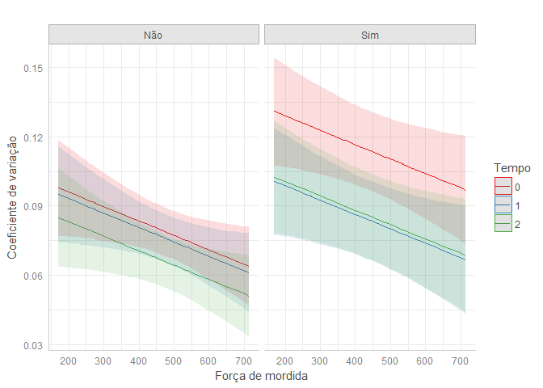

# Introdução

## Introdução

- Neste primeiro momento, o nosso foco será exclusivamente nos __modelos lineares__ para __dados longitudinais__ com __variáveis resposta contínuas__ e __com distribuições aproximadamente simétricas__, __sem caudas excessivamente longas__ (__ou assimetria__) __ou outliers__.
- Estes modelos fornecem as bases para modelos mais gerais para dados longitudinais quando a variável de resposta é discreta ou é uma contagem.
- Nesta aula apresentamos algumas notações de vetores e matrizes e apresentamos um modelo de regressão linear geral para dados longitudinais.

## Introdução

- Nas próximas duas aulas:
    1. Apresentamos uma ampla visão geral de diferentes abordagens para modelar a resposta média ao longo do tempo e para contabilizar a correlação entre medidas repetidas no mesmo indivíduo. 
    2. Consideramos alguns métodos descritivos elementares para explorar dados longitudinais, especialmente tendências na resposta média ao longo do tempo.
    3. Concluímos nossa discussão com uma pesquisa histórica de alguns dos primeiros desenvolvimentos em métodos para analisar dados de medidas longitudinais e repetidas.

## Introdução

- Devemos enfatizar desde o início que os métodos estatísticos apresentados nesta primeira parte usam a suposição de que as respostas longitudinais têm uma __distribuição normal multivariada__ _aproximada_ para derivar estimativas e testes estatísticos, mas não exigem isso.

Normalidade $\rightsquigarrow$ Máxima verossimilhança  $\rightsquigarrow$ Estimação intervalar $\rightsquigarrow$ Testes de hipóteses $\rightsquigarrow$ Avaliação da adequabilidade dos modelos.

# Notação e suposições distribucionais

## Notação

- Assumimos uma amostra de $N$ indivíduos são medidos repedidamente ao longo do tempo.
- Denotamos $Y_{ij}$ a variável respota do $i$-ésimo indivíduo na $j$-ésima ocasião de medição.
- Como mencionado anteriormente, os indivíduos podem não ter o mesmo número de medidas e podem não ser medidos nas mesmas ocasiões.
    + Para tal, utilizamos $n_i$ para representar o número de medidas repetidas e $t_{ij}$ os tempos de medida do $i$-ésimo indivíduo.
        - Se $n$ é o número de __ocasiões planejadas__ do estudo, então $n_i \leq n$.

## Notação

- É conveniente __agrupar__ $n_i$ medidas repetidas da variável resposta do $i$-ésimo indivíduo em um vetor $n_i \times 1$ 

$$
Y_i = \left(\begin{array}{c}
Y_{i1}\\
Y_{i2}\\
\vdots\\
Y_{in_{i}}
\end{array}\right),\ i = 1, \ldots, N.
$$


## Notação

- Presume-se que os vetores de respostas $Y_{i}$, para os $N$ indivíduos, sejam __independentes__ um do outro.
- Observe, no entanto, que embora os vetores de respostas obtidas em diferentes indivíduos possam geralmente ser considerados independentes uns dos outros (por exemplo, não se espera que medidas repetidas de um resultado de saúde para um paciente em um estudo clínico prevejam ou influenciem os resultados de saúde para outro paciente no mesmo estudo), as medidas repetidas sobre o mesmo indivíduo não são enfaticamente consideradas observações independentes.

## Notação

- Quando o número de medidas repetidas é o mesmo para todos os indivíduos do estudo (e não há dados ausentes), não é necessário incluir o índice $i$ em $n_i$ (já que $n_i = n$ para $i = 1, \ldots, N$).
- Da mesma forma, se as medidas repetidas forem observadas no mesmo conjunto de ocasiões, não é necessário incluir o índice $i$ em $t_{ij}$ (já que $t_{ij} = t_i$ para $i = 1, \ldots, N$).

## Notação

- Associado a cada resposta, $Y_{ij}$, há um vetor $p \times 1$ de covariáveis 

$$
X_{ij} = \left(\begin{array}{c}
X_{ij1}\\
X_{ij2}\\
\vdots\\
X_{ijp}
\end{array}\right),\ i = 1, \ldots, N, j = 1, \ldots, n_i.
$$

- Observe que $X_{ij}$ é um vetor de covariáveis associadas a $Y_{ij}$, a variável de resposta para o $i$-ésimo indivíduo na $j$-ésima ocasião.
- As $p$ linhas de $X_{ij}$ correspondem a __diferentes covariáveis__.

## Notação

- Existe um vetor correspondente de covariáveis associado a cada uma das $n_i$ medidas repetidas no $i$-ésimo indivíduo.
    + $X_{i1}$ é o vetor $p \times 1$ cujos elementos são os valores das covariáveis associadas à variável de resposta do $i$-ésimo indivíduo sujeito na 1ª ocasião de medição;
    + $X_{i2}$ é o vetor $p \times 1$ cujos elementos são os valores das covariáveis associadas à variável de resposta do $i$-ésimo indivíduo sujeito na 1ª ocasião de medição e assim por diante.

## Notação

- O vetor $X_{ij}$ pode incluir dois tipos principais de covariáveis: covariáveis cujos valores não mudam ao longo da duração do estudo e covariáveis cujos valores mudam ao longo do tempo.
- Exemplos do primeiro incluem tratamentos experimentais fixos.
- Exemplos deste último incluem o tempo desde a linha de base, o status atual do tabagismo e as exposições ambientais.
- No primeiro caso, os mesmos valores das covariáveis são replicados nas linhas correspondentes de $X_{ij}$ para $j = 1, \ldots, n_i$.
- Neste último caso, os valores obtidos pelas covariáveis podem variar ao longo do tempo (para pelo menos alguns indivíduos) e os valores nas linhas correspondentes de $X_{ij}$ podem ser diferentes a cada ocasião da medição. 

## Notação

- Podemos __agrupar__ os vetores de covariáveis em matrizes $n_i \times p$ de covariáveis:

$$
X_i = \left(\begin{array}{c}
X_{i1}'\\
X_{i2}'\\
\vdots\\
X_{in_i}'
\end{array}\right) = \left(\begin{array}{cccc}
X_{i11} & X_{i12} & \cdots & X_{i1p} \\
X_{i21} & X_{i22} & \cdots & X_{i2p} \\
\vdots & \vdots & \ddots & \vdots \\
X_{in_i1} & X_{in_i2} & \cdots & X_{in_ip} \\
\end{array}\right),\ i = 1, \ldots, N.
$$

- As linhas de $X_i$ correspondem às covariáveis associadas às respostas nas $n_i$ diferentes ocasiões de medição;
- As colunas de $X_i$ correspondem às $p$ covariáveis distintas.

## Notação

- Consideramos um modelo de regressão linear para alterações na resposta média ao longo do tempo e para relacionar as alterações às covariáveis,

\begin{equation}
\label{mod1}
Y_{ij} = \beta_1X_{ij1} + \beta_2X_{ij2} + \ldots + \beta_pX_{ijp} + e_{ij}, j = 1, \ldots, n_i;
\end{equation}

- $\beta_1, \ldots, \beta_p$ são __coeficientes de regressão desconhecidos__ relacionando a média de $Y_{ij}$ às suas correspondentes covariáveis.
- Este modelo descreve como as respostas em cada ocasião são relacionadas com as covariáveis.

\begin{equation}
\label{mod1.longo}
\begin{array}{ccccc}
Y_{i1} & = & \beta_1X_{i11} + \beta_2X_{i12} + \ldots + \beta_pX_{i1p} + e_{i1} & = & X_{i1}'\beta + e_{i1},\\
Y_{i2} & = & \beta_1X_{i21} + \beta_2X_{i22} + \ldots + \beta_pX_{i2p} + e_{i2} & = & X_{i2}'\beta + e_{i2},\\
\vdots & \vdots & \vdots & \vdots & \vdots \\
Y_{in_i} & = & \beta_1X_{in_i1} + \beta_2X_{in_i2} + \ldots + \beta_pX_{in_ip} + e_{in_i} & = & X_{in_i}'\beta + e_{in_i},
\end{array}
\end{equation}

em que $\beta = (\beta_1, \beta_2, \ldots, \beta_p)'$ é um vetor $p \times 1$.

## Notação

- No modelo \eqref{mod1} os $e_{ij}$ são erros aleatórios, com __média zero__, representando desvios das respostas a partir de suas respectivas médias preditas

$$
\E(Y_{ij}|X_{ij}) = \beta_1X_{ij1} + \beta_2X_{ij2} + \ldots + \beta_pX_{ijp}.
$$

- Tipicamente, mas não sempre, $X_{ij1} = 1$ para todo $i$ e $j$, e então $\beta_1$ é o termo de intercepto do modelo.
    + Não utilizaremos $\beta_0$ nem $\alpha$.
    
## Notação

- Por fim, usando notação de vetor e matriz, o modelo de regressão dado por \eqref{mod1} ou \eqref{mod1.longo} pode ser expresso de uma forma ainda mais compacta,

\begin{equation}
\label{mod1.curto}
Y_i = X_i\beta + e_i,
\end{equation}

em que $e_i = (e_{i1}, e_{i2}, \ldots, e_{in_i})'$ é um vetor $n_i \times 1$ de erros aleatórios.

- O modelo de regressão dado por \eqref{mod1.curto} é simplesmente uma representação abreviada para

$$
\left(\begin{array}{c}
Y_{i1}\\
Y_{i2}\\
\vdots\\
Y_{in_{i}}
\end{array}\right) = \left(\begin{array}{cccc}
X_{i11} & X_{i12} & \cdots & X_{i1p} \\
X_{i21} & X_{i22} & \cdots & X_{i2p} \\
\vdots & \vdots & \ddots & \vdots \\
X_{in_i1} & X_{in_i2} & \cdots & X_{in_ip} \\
\end{array}\right) \left(\begin{array}{c}
\beta_{1}\\
\beta_{2}\\
\vdots\\
\beta_{p}
\end{array}\right) + \left(\begin{array}{c}
e_{i1}\\
e_{i2}\\
\vdots\\
e_{in_i}
\end{array}\right).
$$

## Ilustração: Tratamento de crianças expostas ao chumbo

- Lembre-se de que no __estudo sobre tratamento de crianças expostas ao chumbo__, há 100 participantes do estudo que têm níveis de chumbo no sangue medidos no mesmo conjunto de quatro ocasiões: linha de base (ou semana 0), semana l, semana 4 e semana 6.
- Como todos os indivíduos tem o mesmo número de medidas repetidas observadas no mesmo conjunto de ocasiões, o índice $i$ pode ser retirado de $n_i$ e $t_{ij}$.
    + Ou seja, $n_1 = n_2 = \ldots = n_N = n$ e da mesma forma $t_{1j} = t_{2j} = \ldots = t_{Nj} = t_j$ para $j = 1, \ldots, 4$.
- No estudo TLC, o vetor de resposta tem comprimento $4 (n = 4)$ e todos os indivíduos são medidos no mesmo conjunto de ocasiões: $t_1 = 0, t_2 = 1, t_3 = 4\ \mbox{e}\ t_4 = 6$.

## Ilustração: Tratamento de crianças expostas ao chumbo

- Suponha que seja interessante ajustar um modelo à resposta média que pressupõe que o nível médio de chumbo no sangue mude linearmente ao longo do tempo, mas a uma taxa que pode ser diferente para os dois grupos de tratamento.
- Em particular, podemos querer ajustar um modelo em que os dois grupos de tratamento tenham o mesmo intercepto (ou resposta média na linha de base), mas inclinações diferentes.
    + Isso pode ser representado no seguinte modelo de regressão

\begin{eqnarray*}
Y_{ij} &=& \beta_1X_{ij1} + \beta_2X_{ij2} + \beta_3X_{ij3} + e_{ij}\\
&=& X_{ij}'\beta + e_{ij},
\end{eqnarray*}

em que $X_{ij1} = 1$ para todo $i$ e $j$ ($\beta_1$ é um termo de intercepto).

## Ilustração: Tratamento de crianças expostas ao chumbo

- A segunda covariável, $X_{ij2} = t_j$, representa a semana em que o nível de chumbo no sangue foi obtido.
- Por fim, $X_{ij3} = t_1 \times\ \mbox{Grupo}$, em que $\mbox{Grupo}_i = 1$ se o $i$-ésimo indivíduo é designado ao grupo succimer e $\mbox{Grupo}_i = 0$ se o $i$-ésimo indivíduo é designado ao grupo placebo.

## Ilustração: Tratamento de crianças expostas ao chumbo

- Essa codificação de $X_{ij2}$ e $X_{ij3}$ permite que as inclinações do tempo sejam diferentes para os dois grupos de tratamento.
- As três covariáveis podem ser agrupadas em um vetor $3 \times 1$ das covariáveis $X_{ij}$.
- Assim, para crianças do grupo placebo

$$
\E(Y_{ij}|X_{ij}) = \beta_1 + \beta_2t_j.
$$

- $\beta_1$ representa o nível de chumbo no sangue médio na linha de base (semana 0);
- $\beta_2$ tem interpretação como uma mudança no nível médio de chumbo no sangue (em $\mu g/dL$) por semana.

## Ilustração: Tratamento de crianças expostas ao chumbo

- Similarmente para as crianças no grupo succimer

$$
\E(Y_{ij}|X_{ij}) = \beta_1 + (\beta_2 + \beta_3)t_j.
$$

- $\beta_1$ representa o nível de chumbo no sangue médio na linha de base (assumido ser o mesmo como no grupo placebo, pois o ensaio aleatorizou indivíduos para dois grupos);
- $\beta_2 + \beta_3$ tem interpretação como uma mudança no nível médio de chumbo no sangue (em $\mu g/dL$) por semana.
- Assim, se os dois grupos de tratamentos diferem em suas taxas de declínio nos níveis de chumbo no sangue, então $\beta_3 \neq 0$.

## Ilustração: Tratamento de crianças expostas ao chumbo

- Os parâmetros de regressão têm interpretações úteis que se relacionam diretamente com questões de interesse científico.
- Além disso, hipóteses de interesse podem ser expressas em termos da ausência de certos parâmetros de regressão.
- Por exemplo, a hipótese de que os dois tratamentos são igualmente eficazes na redução dos níveis de chumbo no sangue corresponde a uma hipótese que $\beta_3 = 0$.

## Ilustração: Tratamento de crianças expostas ao chumbo

- Os valores das respostas para os indivíduos 79 e 8 são apresentados

$$
Y_{79} = \left(\begin{array}{c}
30.8 \\
26.9 \\
25.8 \\
23.8 
\end{array}\right)\ \mbox{e}\ Y_{8} = \left(\begin{array}{c}
26.5 \\
14.8 \\
19.5 \\
21.0 
\end{array}\right).
$$

## Ilustração: Tratamento de crianças expostas ao chumbo

- Associados aos vetores de repostas, temos as matrizes de covariáveis

$$
X_{79} = \left(\begin{array}{ccc}
1 & 0 & 0 \\
1 & 1 & 0 \\
1 & 4 & 0 \\
1 & 6 & 0 
\end{array}\right)\ \mbox{e}\ X_{8} = \left(\begin{array}{ccc}
1 & 0 & 0 \\
1 & 1 & 1 \\
1 & 4 & 4 \\
1 & 6 & 6
\end{array}\right).
$$

## Ilustração: Tratamento de crianças expostas ao chumbo

\footnotesize

- O modelo para a média dos níveis de chumbo no sangue pode ser representado

$$
\E(Y_i|X_i) = X_i\beta,
$$

$$
\E(Y_i|X_i) = \left(\begin{array}{c}
\E(Y_{i1}|X_{i1}) \\
\E(Y_{i2}|X_{i2}) \\
\E(Y_{i3}|X_{i3}) \\
\E(Y_{i4}|X_{i4}) 
\end{array}\right) = \left(\begin{array}{ccc}
1 & 0 & 0 \\
1 & 1 & 0 \\
1 & 4 & 0 \\
1 & 6 & 0 
\end{array}\right) \left(\begin{array}{c}
\beta_1\\
\beta_2\\
\beta_3
\end{array}\right) = \left(\begin{array}{c}
\beta_1\\
\beta_1 + \beta_2\\
\beta_1 + 4\beta_2\\
\beta_1 + 6\beta_2
\end{array}\right) 
$$

para crianças no grupo placebo, e

$$
\E(Y_i|X_i) = \left(\begin{array}{c}
\E(Y_{i1}|X_{i1}) \\
\E(Y_{i2}|X_{i2}) \\
\E(Y_{i3}|X_{i3}) \\
\E(Y_{i4}|X_{i4}) 
\end{array}\right) = \left(\begin{array}{ccc}
1 & 0 & 0 \\
1 & 1 & 1 \\
1 & 4 & 4 \\
1 & 6 & 6 
\end{array}\right) \left(\begin{array}{c}
\beta_1\\
\beta_2\\
\beta_3
\end{array}\right) = \left(\begin{array}{c}
\beta_1\\
\beta_1 + (\beta_2 + \beta_3)\\
\beta_1 + 4(\beta_2 + \beta_3)\\
\beta_1 + 6(\beta_2 + \beta_3)
\end{array}\right) 
$$

para crianças no grupo succimer.

## Suposições distribucionais

- Até agora, as únicas suposições feitas diziam respeito a padrões de mudança na resposta média ao longo do tempo e sua relação com covariáveis.
- Especificamente, dado que o vetor de erros aleatórios, $e_i$, é assumido como tendo média zero, o modelo de regressão dado por \eqref{mod1.curto} implica que 

\begin{equation}
\label{mod1.media}
\E(Y_i|X_i) = \mu_i = X_i\beta,
\end{equation}

em que $\mu_i = (\mu_{i1}, \ldots, \mu_{in_i})'$ é o vetor $n_i \times 1$ de médias condicionais para o $i$-ésimo indivíduo, com $\mu_{ij} = \E(Y_{ij}|X_i) = \E(Y_{ij}|X_{ij})$.

## Suposições distribucionais

- Em seguida, consideramos as suposições distribucionais relativas ao vetor de erros aleatórios, $e_i$.
- O vetor de resposta $Y_i$ em \eqref{mod1.curto} é assumido como sendo composto por dois componentes:
    1. um "componente sistemático", $X_i\beta$
    2. um "componente aleatório", $e_i$.
- A variabilidade aleatória de $Y_i$ decorre da adição de $e_i$.
    + Isso implica que suposições feitas sobre a forma da distribuição dos erros aleatórios se traduzem em suposições sobre a forma da __distribuição condicional__ de $Y_i$ dado $X_i$.

## Suposições distribucionais

- Em seguida, $Y_i$, o vetor de respostas contínuas, é assumido como tendo uma distribuição condicional que é __normal multivariada__, com vetor de resposta médio

$$
\E(Y_i|X_i) = \mu_i = X_i\beta
$$

e matriz de covariância

$$
\Sigma_i = \Cov(Y_i|X_i).
$$

- Lembre-se de que, embora as observações de indivíduos diferentes sejam consideradas independentes umas das outras, as medidas repetidas do mesmo indivíduo não são consideradas independentes.
    + Essa falta de independência é capturada pelos elementos fora da diagonal da matriz de covariância $\Sigma_i$.

## A distribuição normal multivariada

- A base para grande parte da estatística é baseada na teoria das probabilidades.
- De fato, a base formal para muitos métodos estatísticos é uma distribuição de probabilidade assumida para a variável resposta.
- Em termos gerais, uma distribuição de probabilidade descreve a frequência relativa de ocorrência de valores particulares da variável resposta.
- Em particular, a função de densidade de probabilidade para $Y$, descrita por $f(y)$, descreve a frequência relativa de ocorrência de valores particulares de $Y$.

## A distribuição normal multivariada

- A distribuição normal (gaussiana) multivariada é uma generalização natural da distribuição normal univariada.
- A função densidade de probabilidade conjunta normal multivariada para $Y_i$ dado $X_i$ pode ser expresso como

\begin{eqnarray*}
f(y_i) &=& f(y_{i1}, y_{i2}, \ldots, y_{in_i}) \\
 &=& (2\pi)^{-n_i/2}|\Sigma_i|^{-1/2}\exp\left\{-\frac{1}{2}(y_i - \mu_i)'\Sigma_i^{-1}(y_i - \mu_i)\right\},
\end{eqnarray*}

em que 

- $-\infty < y_{ij} < \infty$ para $j = 1, \ldots, n_i$,
- $\mu_i = \E(Y_i|X_i) = (\mu_{i1}, \ldots, \mu_{in_i})'$,
- $\Sigma_i = \Cov(Y_i|X_i)$,
- e $|\Sigma_i|$ denota o __determinante__ de $\Sigma_i$.

## A distribuição normal multivariada

```{r echo=FALSE, fig.align='center', message=FALSE, warning=FALSE, out.width='100%', paged.print=FALSE}
knitr::include_graphics(here::here('images', 'bivariate_gaussian.png'))
```

## A distribuição normal multivariada

- A suposição de normalidade multivariada não é crucial para __estimação__ e validade das inferências com respeito a $\beta$ quando os dados são completos (sem ausência de dados).
- Os desvios da normalidade, a menos que sejam muito extremos (por exemplo, dados de resposta altamente assimétricos), não são tão críticos.
- No cenário de dados longitudinais, existem resultados muito semelhantes, o que sugere que são as suposições sobre a dependência entre os erros e as suposições sobre as variações e covariâncias que têm maior impacto na inferência estatística.
    + Desvios da normalidade multivariada, a menos que sejam muito extremas, não são tão críticas.

# Breve introdução ao `R`

## O que é o `R`?

- O `R` é uma linguagem de programação desenvolvida para:
    + Manipulação de dados;
    + Análise estatística;
    + Visualização de dados.
- O que diferencia o `R` de outras ferramentas de análise de dados?
    + Desenvolvido por estatísticos;
    + É um software livre;
    + É extensível através de pacotes.

\begin{center}
\includegraphics[width=0.3\columnwidth]{Figuras/Rlogo}
\end{center}

## Breve histórico {.allowframebreaks}

\begin{itemize}\setlength{\itemsep}{+2.5mm}
\item \structure{{\ttfamily R}} é a versão livre, de código aberto, e gratuita do \structure{\sffamily S}.
\begin{itemize}\setlength{\itemsep}{+1.5mm}
\item Nos anos 1980 o \structure{\sffamily S} foi desenvolvido nos \structure{Laboratórios Bell}, por \structure{John Chambers}, para análise de dados e geração de gráficos.
\end{itemize}
\begin{center}
\includegraphics[width=0.25\columnwidth]{Figuras/bell_labs}
\hspace{0.25cm}
\includegraphics[width=0.25\columnwidth]{Figuras/john_chambers}
\end{center}
\framebreak
\item O \structure{{\ttfamily R}} foi inicialmente escrito no começo dos anos 1990.
\begin{itemize}\setlength{\itemsep}{+0.15mm}
\item \structure{Robert Gentleman} e \structure{Ross Ihaka} no Dep. de Estatística da Universidade de Auckland.
\item O nome \structure{{\ttfamily R}} se dá em parte por reconhecer a influência do \structure{\sffamily S} e por ser a inicial dos nomes \structure{Robert} e \structure{Ross}.
\end{itemize}
\begin{center}
\includegraphics[width=0.15\columnwidth]{Figuras/University_of_Auckland_Coat_of_Arms}
\hspace{0.25cm}
\includegraphics[width=0.35\columnwidth]{Figuras/Robert_e_Ross}
\end{center}
\item Desde 1997 possui um grupo de 20 desenvolvedores.
\begin{itemize}
\item A cada 6 meses uma nova versão é disponibilizada contendo atualizações.
\end{itemize}
\end{itemize}

## Interface do `R`

\begin{center}
\includegraphics[width=1\columnwidth]{Figuras/R_console}
\end{center}

## Como trabalhar com o `R`?

\begin{itemize}\setlength{\itemsep}{+3.5mm}
\item Por ser uma linguagem de programação, o \structure{{\ttfamily R}} realiza suas tarefas através de \structure{funções} e \structure{operadores}.
\begin{itemize}\setlength{\itemsep}{+2.5mm}
\item A criação de \structure{\emph{scripts}} (rotinas) é \structure{a melhor prática para se trabalhar} com o {\ttfamily R}.
\begin{itemize}\setlength{\itemsep}{+2.5mm}
\item \structure{OBSERVAÇÃO:} sempre salve seus scripts (em um pen drive, dropbox ou e-mail); você pode querer utilizá-los novamente no futuro.
\end{itemize}
\item Utilização de editores de texto: \structure{bloco de notas}, \structure{Notepad ++}, \structure{Tinn-R}, etc.
\item Interfaces de {\ttfamily R} para usuários: \structure{RStudio}.
\end{itemize}
\end{itemize}

## Editores de texto

\begin{center}
\includegraphics[width=0.55\columnwidth]{Figuras/Hello_bloco}
\end{center}

## Editores de texto

\begin{center}
\includegraphics[width=0.65\columnwidth]{Figuras/Hello_notepad}
\end{center}

## Interface do RStudio

\begin{center}
\includegraphics[width=1\columnwidth]{Figuras/RStudio}
\end{center}

## Analisando dados

\structure{Fases de análise}

\begin{columns}[c]
\column{1.2in}
\begin{figure}[!h]
\begin{center}
\includegraphics[width=0.9\columnwidth]{Figuras/CoxBook}
\end{center}
\end{figure}
\column{3.4in}
\begin{enumerate}
\item {\small \structure{Manipulação inicial} dos dados.}
\begin{itemize}
\item {\scriptsize Limpeza dos dados.}
\item {\scriptsize Criação, transformação e recodificação de variáveis.}
\end{itemize}
\item {\small \structure{Análise preliminar}.}
\begin{itemize}
\item {\scriptsize Conhecimento dos dados, identificação de outliers, investigação preliminar.}
\end{itemize}
\item {\small \structure{Análise definitiva}.}
\begin{itemize}
\item {\scriptsize Disponibiliza a base para as conclusões.}
\end{itemize}
\item {\small \structure{Apresentação das conclusões} de forma precisa, concisa e lúcida.}
\end{enumerate}
\end{columns}

## Você pode usar o `R` para

- __Importação e exportação de dados__
- __Manipulação de dados:__ Transformação e recodificação de variáveis; Aplicação de filtros
- __Visualização de dados:__ Diversos gráficos; Mapas; Gráficos e mapas interativos
- __Análise de dados:__ Análise descritiva; Ajuste de modelos; Técnicas multivariadas; Análise de amostras complexas
- __Geração de relatórios:__ Relatórios nos formatos pdf, HTML, Word, Power Point

\structure{Resumindo:} você pode usar o `R` em todas as etapas de uma análise de dados!

## Gráficos do `R`

\begin{center}
\includegraphics[width=0.8\columnwidth]{Figuras/geom_scatter}
\end{center}

## Comunicação de resultados através do `R`: `R Markdown`

\begin{columns}[c]
\column{1.9in}
\begin{figure}[!h]
\begin{center}
\includegraphics[width=0.9\columnwidth]{Figuras/bandThree2}
\end{center}
\end{figure}
\column{2.7in}
\begin{enumerate}
\item {\small Produz \structure{documentos dinâmicos} em {\ttfamily R}.}
\item {\small Documentos {\ttfamily R Markdown} são completamente \structure{reproduzíveis}.}
\item {\small {\ttfamily R Markdown} suporta dezenas de formatos de saída, incluindo \structure{HTML}, \structure{PDF}, \structure{MS Word}, \structure{Beamer}, \structure{ \emph{dashboards}}, \structure{aplicações {\ttfamily shiny}}, \structure{artigos científicos} e muito mais.}
\end{enumerate}
\end{columns}

## Comunicação de resultados através do `R`: `CompareGroups`

```{r echo=FALSE, fig.align='center', message=FALSE, warning=FALSE, out.width='90%', paged.print=FALSE}

```

## Comunicação de resultados através do `R`: `stargazer`

```{r echo=FALSE, fig.align='center', message=FALSE, warning=FALSE, out.width='80%', paged.print=FALSE}

```

## Comunicação de resultados através do `R`

```{r echo=FALSE, fig.align='center', message=FALSE, warning=FALSE, out.width='60%', paged.print=FALSE}

```

## Comunicação de resultados através do `R`

```{r echo=FALSE, fig.align='center', message=FALSE, warning=FALSE, out.width='80%', paged.print=FALSE}

```

## Comunicação de resultados através do `R`: `Shiny`

- `Shiny` é um pacote do `R` que torna mais fácil a construção de \structure{aplicações web interativas} (apps) diretamente do `R`.
    + Permite a criação e compartilhamento de aplicativos.
    + Espera \structure{nenhum conhecimento} de tecnologias web como HTML, CSS ou JavaScript (mas você pode aproveitá-las, caso as conheça)
    + Um aplicativo `Shiny` consiste em duas partes: uma \structure{interface de usuário} (UI) e um \structure{servidor}.

## `Shiny`

\footnotesize

```{r, echo=TRUE, eval=FALSE}
# Run the application 
shinyApp(ui = ui, server = server)
```

\begin{columns}[c]
\column{2.3in}
\begin{figure}[!h]
\begin{center}
\includegraphics[width=0.9\columnwidth]{Figuras/shinyAppEx1}
\end{center}
\end{figure}
\column{2.3in}
\begin{figure}[!h]
\begin{center}
\includegraphics[width=0.9\columnwidth]{Figuras/shinyAppEx1_2}
\end{center}
\end{figure}
\end{columns}

## Baixando e instalando o `R`

Para instalação do `R` acesse o site https://www.r-project.org/:

1. Em __Download__ clique em CRAN.
    + O __CRAN__ (_The Comprehensive R Archive Network_) é uma rede de servidores ftp e web em todo o mundo que armazena versões de código e documentação idênticas e atualizadas para o `R`.
2. Escolha um repositório de sua preferência, por exemplo, Universidade Federal do Paraná (http://cran-r.c3sl.ufpr.br/).
3. Em __Download and Install R__ clique no link adequado para o seu sistema operacional (no caso de Windows, clique no link __Download R for Windows__).
4. Clique no link __base__ (no caso do sistema operacional ser Windows).
5. Finalmente clique no link para baixar o arquivo executável (a versão mais atual __Download R 3.5.1 for Windows__).

Após baixar o arquivo executável, abra-o e siga as etapas de instalação conforme as configurações padrões.

## Baixando e instalando o `RStudio`

Para instalação do `RStudio` acesse o site https://www.rstudio.com/products/rstudio/download/. 

- Em __Installers for Supported Platforms__ baixe a versão mais recente do instalador do `RStudio` de acordo com o seu sistema operacional (no caso de Windows clique no link __RStudio 1.1.456 - Windows Vista/7/8/10__).

## Pacotes {.allowframebreaks}

- Assim como a maioria dos softwares estatísticos, o `R` possui os seus "módulos", mais conhecidos como __pacotes__ do `R`.
- __Pacote:__ é uma coleção de funções do `R`; os pacotes também são gratuitos e disponiblizados no __CRAN__.
- Um pacote inclui: __funções__ do `R`, __conjuntos de dados__ (utilizados em exemplos das funções), arquivo com __ajuda__ __(_help_)__, e uma __descrição__ do pacote.
- Atualmente, o repositório oficial do `R` possui mais de 12.000 pacotes disponíveis.
- As funcionalidades do `R`, podem ser ampliadas carregando estes pacotes, tornando-o um software muito poderoso, capaz de realizar inúmeras tarefas.

## Pacotes {.allowframebreaks}

- Alguns exemplos destas tarefas e alguns destes pacotes são listados abaixo:
    + __Importação e exportação de dados__
        - `foreign`, `readr`, `haven`
    + __Manipulação de dados__
        - Transformação e recodificação de variáveis: `reshape2`, `stringr`
    + __Visualização de dados__
        - Diversos gráficos: `graphics`, `ggplot2`, `ggthemes`
        - Mapas: `ggmap`
        - Gráficos e mapas interativos: `plotly`
    + __Análise de dados__
        - Análise descritiva: `compareGroups`
        - Ajuste de modelos: `stats`, `survival`
        - Análise de amostras complexas: `survey`
    + __Geração de relatórios__
        - Relatórios nos formatos pdf, HTML, Word, Power Point: `knitr`, `rmarkdow`, `officer`

<!-- ## Exemplos de pacotes -->

<!-- - `maptools`: Funções para leitura, exportação e manipulação de estruturas espaciais. -->
<!-- - `epibasix`: Ferramentas elementares para análise de problemas epidemiológicos. -->
<!-- - `survey`: Análise de pequisas com planos amostrais complexos. -->
<!-- - `ggplot2`: Criação de gráficos elegantes. -->
<!-- - `survival`: Análise de dados de sobrevivência . -->
<!-- - O `R` possui mais de \alert{10.751} pacotes, e milhares de funções. -->
<!-- - \structure{Resumindo:} para o `R` não existe o \alert{"SE É POSSÍVEL FAZER"}, mas sim, \alert{"COMO É POSSÍVEL FAZER"}! -->


## Instalando pacotes {.allowframebreaks}

- Para \structure{instalação de um pacote}, basta um simples comando.

```{r, echo=TRUE, eval=FALSE}
install.packages("survey")
```

- Além da opção de comando, também podemos instalar pacotes utilizando o menu \structure{Tools} do `RStudio`, opção \structure{Install packages ...} e preenchendo com o(s) nome(s) do(s) pacote(s):

\begin{center}
\includegraphics[width=0.4\columnwidth]{Figuras/install_packs}
\end{center}

- Outra opção é instalar o pacote a partir de seu arquivos fonte (\structure{.zip} ou \structure{.tar.gz}):
    + Para isso, obtenha o arquivo fonte do pacote (geralmente através do \structure{CRAN}) e no menu \structure{Tools} do `RStudio`, opção \structure{Install packages ...} em \structure{Install from} escolha a seguinte opção:

\begin{center}
\includegraphics[width=0.4\columnwidth]{Figuras/install_packs2}
\end{center}

Após a instalação do pacote, temos que \structure{carregar o pacote} para nossa área de trabalho para podermos usufruir de suas funções.

```{r, echo=TRUE, eval=FALSE}
library("survey")
require("survey")
```

## Obtendo ajuda no R {.allowframebreaks}

- Para conhecer quais as funções disponíveis no pacote, faça:

```{r, echo=TRUE, eval=FALSE}
help(package = "survey")
```

- Para pedir ajuda de uma determinada função:

```{r, echo=TRUE, eval=FALSE}
?glm
help("glm")
```

- Obtendo ajuda na internet:

```{r, echo=TRUE, eval=FALSE}
help.search("t.test")
```

\framebreak

- Procurando por alguma função, mas esqueci o nome:

```{r, echo=TRUE, eval=FALSE}
apropos("lm")
```

- Para todas as outras dúvidas existe o \alert{{\bf Google!}}
- Ver também \alert{http://www.r-bloggers.com/} e \alert{https://rstudio.cloud/}
- Para algumas demonstrações da capacidade gráfica do `R`:

```{r, echo=TRUE, eval=FALSE}
demo(graphics)
demo(persp)
demo(Hershey)
demo(plotmath)
```

# Exercícios

## Exercícios

- Com o auxílio do computador, faça os exercícios do Capítulo 2 do livro "__Applied Longitudinal Analysis__" (páginas 44 e 45).
- Enviar soluções pelo Moodle através do fórum.

## Avisos

- __Para casa:__ ler o Capítulo 3 do livro "__Applied Longitudinal Analysis__". Caso ainda não tenha lido, leia também os Caps. 1 e 2.
    + Ver https://datathon-ufrgs.github.io/Pintando_e_Bordando_no_R/
- __Próxima aula:__ Métodos de análise descritiva para dados longitudinais.

## Bons estudos!

```{r echo=FALSE, fig.align='center', message=FALSE, warning=FALSE, out.width='100%', paged.print=FALSE}
knitr::include_graphics(here::here('images', 'supeRRR.jpg'))
```
