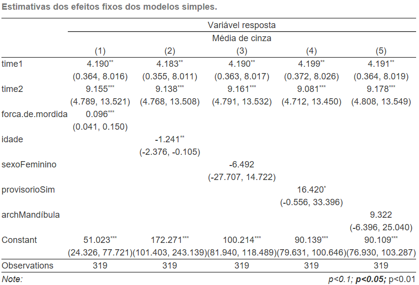
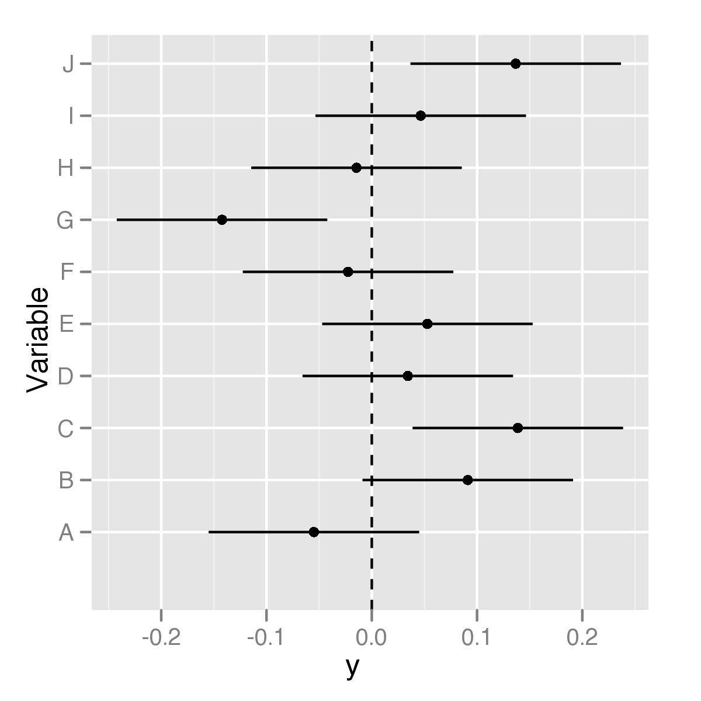

# Breve introdução ao `R`

## O que é o `R`?

- O `R` é uma linguagem de programação desenvolvida para:
    + Manipulação de dados;
    + Análise estatística;
    + Visualização de dados.
- O que diferencia o `R` de outras ferramentas de análise de dados?
    + Desenvolvido por estatísticos;
    + É um software livre;
    + É extensível através de pacotes.

```{r echo=FALSE, fig.align='center', message=FALSE, warning=FALSE, out.width='40%', paged.print=FALSE}
knitr::include_graphics(here::here('images', 'Rlogo.png'))
```

## Breve histórico

- \structure{{\ttfamily R}} é a versão livre, de código aberto, e gratuita do \structure{\sffamily S}.
    + Nos anos 1980 o \structure{\sffamily S} foi desenvolvido nos \structure{Laboratórios Bell}, por \structure{John Chambers}, para análise de dados e geração de gráficos.

```{r echo=FALSE, fig.align='center', message=FALSE, warning=FALSE, out.width='80%', paged.print=FALSE}

library(cowplot)
library(ggplot2)

p1 <- ggdraw() + draw_image(here::here('images', 'bell_labs.jpg'), scale = 0.9)
p2 <- ggdraw() + draw_image(here::here('images', 'john_chambers.jpg'), scale = 0.9)

plot_grid(p1, p2)
```

## Breve histórico

- O \structure{{\ttfamily R}} foi inicialmente escrito no começo dos anos 1990.
    + \structure{Robert Gentleman} e \structure{Ross Ihaka} no Dep. de Estatística da Universidade de Auckland.
- O nome \structure{{\ttfamily R}} se dá em parte por reconhecer a influência do \structure{\sffamily S} e por ser a inicial dos nomes \structure{Robert} e \structure{Ross}.

```{r echo=FALSE, fig.align='center', message=FALSE, warning=FALSE, out.width='50%', paged.print=FALSE}

library(cowplot)
library(ggplot2)

p1 <- ggdraw() + draw_image(here::here('images', 'University_of_Auckland_Coat_of_Arms.png'), scale = 0.9)
p2 <- ggdraw() + draw_image(here::here('images', 'Robert_e_Ross.png'), scale = 0.9)

plot_grid(p1, p2)
```

- Desde 1997 possui um grupo de 20 desenvolvedores.
    + A cada 6 meses uma nova versão é disponibilizada contendo atualizações.

## Interface do `R`

```{r echo=FALSE, fig.align='center', message=FALSE, warning=FALSE, out.width='80%', paged.print=FALSE}

knitr::include_graphics(here::here('images', 'R_console.jpg'))

```

## Como trabalhar com o `R`?

- Por ser uma linguagem de programação, o \structure{{\ttfamily R}} realiza suas tarefas através de \structure{funções} e \structure{operadores}.
    + A criação de \structure{\emph{scripts}} (rotinas) é \structure{a melhor prática para se trabalhar} com o {\ttfamily R}.
        - \structure{OBSERVAÇÃO:} sempre salve seus scripts (em um pen drive, dropbox ou e-mail); você pode querer utilizá-los novamente no futuro.
    + Utilização de editores de texto: \structure{bloco de notas}, \structure{Notepad ++}, \structure{Tinn-R}, etc.
    + Interfaces de {\ttfamily R} para usuários: \structure{RStudio}.

## Editores de texto

```{r echo=FALSE, fig.align='center', message=FALSE, warning=FALSE, out.width='80%', paged.print=FALSE}

knitr::include_graphics(here::here('images', 'Hello_bloco.png'))

```

## Editores de texto

```{r echo=FALSE, fig.align='center', message=FALSE, warning=FALSE, out.width='80%', paged.print=FALSE}

knitr::include_graphics(here::here('images', 'Hello_notepad.png'))

```

## Interface do RStudio

```{r echo=FALSE, fig.align='center', message=FALSE, warning=FALSE, out.width='80%', paged.print=FALSE}

knitr::include_graphics(here::here('images', 'RStudio.png'))

```

## Analisando dados

\structure{Fases de análise}

\begin{columns}[c]
\column{1.2in}
\begin{figure}[!h]
\begin{center}
\includegraphics[width=0.9\columnwidth]{Figuras/CoxBook}
\end{center}
\end{figure}
\column{3.4in}
\begin{enumerate}
\item {\small \structure{Manipulação inicial} dos dados.}
\begin{itemize}
\item {\scriptsize Limpeza dos dados.}
\item {\scriptsize Criação, transformação e recodificação de variáveis.}
\end{itemize}
\item {\small \structure{Análise preliminar}.}
\begin{itemize}
\item {\scriptsize Conhecimento dos dados, identificação de outliers, investigação preliminar.}
\end{itemize}
\item {\small \structure{Análise definitiva}.}
\begin{itemize}
\item {\scriptsize Disponibiliza a base para as conclusões.}
\end{itemize}
\item {\small \structure{Apresentação das conclusões} de forma precisa, concisa e lúcida.}
\end{enumerate}
\end{columns}

## Você pode usar o `R` para

- __Importação e exportação de dados__
- __Manipulação de dados:__ Transformação e recodificação de variáveis; Aplicação de filtros
- __Visualização de dados:__ Diversos gráficos; Mapas; Gráficos e mapas interativos
- __Análise de dados:__ Análise descritiva; Ajuste de modelos; Técnicas multivariadas; Análise de amostras complexas
- __Geração de relatórios:__ Relatórios nos formatos pdf, HTML, Word, Power Point

\structure{Resumindo:} você pode usar o `R` em todas as etapas de uma análise de dados!

## Gráficos do `R`

\begin{center}
\includegraphics[width=0.8\columnwidth]{Figuras/geom_scatter}
\end{center}

## Comunicação de resultados através do `R`: `R Markdown`

\begin{columns}[c]
\column{1.9in}
\begin{figure}[!h]
\begin{center}
\includegraphics[width=0.9\columnwidth]{Figuras/bandThree2}
\end{center}
\end{figure}
\column{2.7in}
\begin{enumerate}
\item {\small Produz \structure{documentos dinâmicos} em {\ttfamily R}.}
\item {\small Documentos {\ttfamily R Markdown} são completamente \structure{reproduzíveis}.}
\item {\small {\ttfamily R Markdown} suporta dezenas de formatos de saída, incluindo \structure{HTML}, \structure{PDF}, \structure{MS Word}, \structure{Beamer}, \structure{ \emph{dashboards}}, \structure{aplicações {\ttfamily shiny}}, \structure{artigos científicos} e muito mais.}
\end{enumerate}
\end{columns}

## Comunicação de resultados através do `R`: `CompareGroups`

```{r echo=FALSE, fig.align='center', message=FALSE, warning=FALSE, out.width='90%', paged.print=FALSE}
knitr::include_graphics('Figuras/compare_groups.png')
```

## Comunicação de resultados através do `R`: `stargazer`

```{r echo=FALSE, fig.align='center', message=FALSE, warning=FALSE, out.width='80%', paged.print=FALSE}

```

## Comunicação de resultados através do `R`

```{r echo=FALSE, fig.align='center', message=FALSE, warning=FALSE, out.width='60%', paged.print=FALSE}

```

## Comunicação de resultados através do `R`

```{r echo=FALSE, fig.align='center', message=FALSE, warning=FALSE, out.width='80%', paged.print=FALSE}
knitr::include_graphics('Figuras/coef_variacao_modelo-1.png')
```

## Comunicação de resultados através do `R`: `Shiny`

- `Shiny` é um pacote do `R` que torna mais fácil a construção de \structure{aplicações web interativas} (apps) diretamente do `R`.
    + Permite a criação e compartilhamento de aplicativos.
    + Espera \structure{nenhum conhecimento} de tecnologias web como HTML, CSS ou JavaScript (mas você pode aproveitá-las, caso as conheça)
    + Um aplicativo `Shiny` consiste em duas partes: uma \structure{interface de usuário} (UI) e um \structure{servidor}.

## `Shiny`

\footnotesize

```{r, echo=TRUE, eval=FALSE}
# Run the application 
shinyApp(ui = ui, server = server)
```

\begin{columns}[c]
\column{2.3in}
\begin{figure}[!h]
\begin{center}
\includegraphics[width=0.9\columnwidth]{Figuras/shinyAppEx1}
\end{center}
\end{figure}
\column{2.3in}
\begin{figure}[!h]
\begin{center}
\includegraphics[width=0.9\columnwidth]{Figuras/shinyAppEx1_2}
\end{center}
\end{figure}
\end{columns}

## Baixando e instalando o `R`

Para instalação do `R` acesse o site https://www.r-project.org/:

1. Em __Download__ clique em CRAN.
    + O __CRAN__ (_The Comprehensive R Archive Network_) é uma rede de servidores ftp e web em todo o mundo que armazena versões de código e documentação idênticas e atualizadas para o `R`.
2. Escolha um repositório de sua preferência, por exemplo, Universidade Federal do Paraná (http://cran-r.c3sl.ufpr.br/).
3. Em __Download and Install R__ clique no link adequado para o seu sistema operacional (no caso de Windows, clique no link __Download R for Windows__).
4. Clique no link __base__ (no caso do sistema operacional ser Windows).
5. Finalmente clique no link para baixar o arquivo executável (a versão mais atual __Download R 3.5.1 for Windows__).

Após baixar o arquivo executável, abra-o e siga as etapas de instalação conforme as configurações padrões.

## Baixando e instalando o `RStudio`

Para instalação do `RStudio` acesse o site https://www.rstudio.com/products/rstudio/download/. 

- Em __Installers for Supported Platforms__ baixe a versão mais recente do instalador do `RStudio` de acordo com o seu sistema operacional (no caso de Windows clique no link __RStudio 1.1.456 - Windows Vista/7/8/10__).

## Pacotes {.allowframebreaks}

- Assim como a maioria dos softwares estatísticos, o `R` possui os seus "módulos", mais conhecidos como __pacotes__ do `R`.
- __Pacote:__ é uma coleção de funções do `R`; os pacotes também são gratuitos e disponibilizados no __CRAN__.
- Um pacote inclui: __funções__ do `R`, __conjuntos de dados__ (utilizados em exemplos das funções), arquivo com __ajuda__ __(_help_)__, e uma __descrição__ do pacote.
- Atualmente, o repositório oficial do `R` possui mais de 12.000 pacotes disponíveis.
- As funcionalidades do `R`, podem ser ampliadas carregando estes pacotes, tornando-o um software muito poderoso, capaz de realizar inúmeras tarefas.

## Pacotes {.allowframebreaks}

- Alguns exemplos destas tarefas e alguns destes pacotes são listados abaixo:
    + __Importação e exportação de dados__
        - `foreign`, `readr`, `haven`
    + __Manipulação de dados__
        - Transformação e recodificação de variáveis: `reshape2`, `stringr`
    + __Visualização de dados__
        - Diversos gráficos: `graphics`, `ggplot2`, `ggthemes`
        - Mapas: `ggmap`
        - Gráficos e mapas interativos: `plotly`
    + __Análise de dados__
        - Análise descritiva: `compareGroups`
        - Ajuste de modelos: `stats`, `survival`
        - Análise de amostras complexas: `survey`
    + __Geração de relatórios__
        - Relatórios nos formatos pdf, HTML, Word, Power Point: `knitr`, `rmarkdow`, `officer`

<!-- ## Exemplos de pacotes -->

<!-- - `maptools`: Funções para leitura, exportação e manipulação de estruturas espaciais. -->
<!-- - `epibasix`: Ferramentas elementares para análise de problemas epidemiológicos. -->
<!-- - `survey`: Análise de pequisas com planos amostrais complexos. -->
<!-- - `ggplot2`: Criação de gráficos elegantes. -->
<!-- - `survival`: Análise de dados de sobrevivência . -->
<!-- - O `R` possui mais de \alert{10.751} pacotes, e milhares de funções. -->
<!-- - \structure{Resumindo:} para o `R` não existe o \alert{"SE É POSSÍVEL FAZER"}, mas sim, \alert{"COMO É POSSÍVEL FAZER"}! -->


## Instalando pacotes {.allowframebreaks}

- Para \structure{instalação de um pacote}, basta um simples comando.

```{r, echo=TRUE, eval=FALSE}
install.packages("survey")
```

- Além da opção de comando, também podemos instalar pacotes utilizando o menu \structure{Tools} do `RStudio`, opção \structure{Install packages ...} e preenchendo com o(s) nome(s) do(s) pacote(s):

\begin{center}
\includegraphics[width=0.4\columnwidth]{Figuras/install_packs}
\end{center}

- Outra opção é instalar o pacote a partir de seu arquivos fonte (\structure{.zip} ou \structure{.tar.gz}):
    + Para isso, obtenha o arquivo fonte do pacote (geralmente através do \structure{CRAN}) e no menu \structure{Tools} do `RStudio`, opção \structure{Install packages ...} em \structure{Install from} escolha a seguinte opção:

\begin{center}
\includegraphics[width=0.4\columnwidth]{Figuras/install_packs2}
\end{center}

Após a instalação do pacote, temos que \structure{carregar o pacote} para nossa área de trabalho para podermos usufruir de suas funções.

```{r, echo=TRUE, eval=FALSE}
library("survey")
require("survey")
```

## Obtendo ajuda no R {.allowframebreaks}

- Para conhecer quais as funções disponíveis no pacote, faça:

```{r, echo=TRUE, eval=FALSE}
help(package = "survey")
```

- Para pedir ajuda de uma determinada função:

```{r, echo=TRUE, eval=FALSE}
?glm
help("glm")
```

- Obtendo ajuda na internet:

```{r, echo=TRUE, eval=FALSE}
help.search("t.test")
```

\framebreak

- Procurando por alguma função, mas esqueci o nome:

```{r, echo=TRUE, eval=FALSE}
apropos("lm")
```

- Para todas as outras dúvidas existe o \alert{{\bf Google!}}
- Ver também \alert{http://www.r-bloggers.com/} e \alert{https://rstudio.cloud/}
- Para algumas demonstrações da capacidade gráfica do `R`:

```{r, echo=TRUE, eval=FALSE}
demo(graphics)
demo(persp)
demo(Hershey)
demo(plotmath)
```

# Exercícios

## Exercícios

- Com o auxílio do computador, faça os exercícios do Capítulo 2 do livro "__Applied Longitudinal Analysis__" (páginas 44 e 45).
- Enviar soluções pelo Moodle através do fórum.

## Avisos

- __Para casa:__ ler o Capítulo 3 do livro "__Applied Longitudinal Analysis__". Caso ainda não tenha lido, leia também os Caps. 1 e 2.
    + Ver https://datathon-ufrgs.github.io/Pintando_e_Bordando_no_R/
- __Próxima aula:__ Métodos de análise descritiva para dados longitudinais.

## Bons estudos!

```{r echo=FALSE, fig.align='center', message=FALSE, warning=FALSE, out.width='100%', paged.print=FALSE}
knitr::include_graphics(here::here('images', 'supeRRR.jpg'))
```
